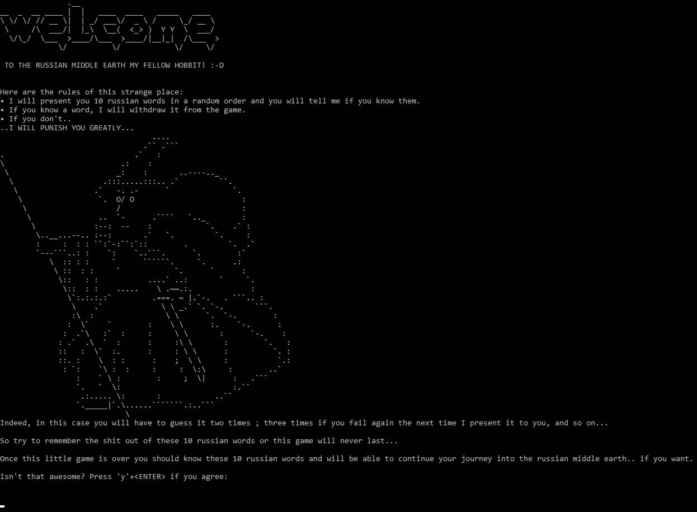

# learn_russian
An ascii game written in python to learn new russian words from french.

The executable file opens for x64 architectures and will probably trigger a Windows warning.

If you don't trust it you can open the python file instead.

